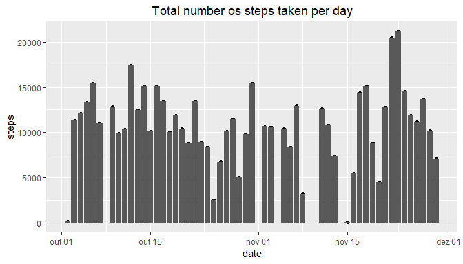
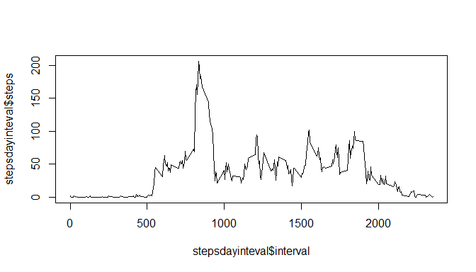
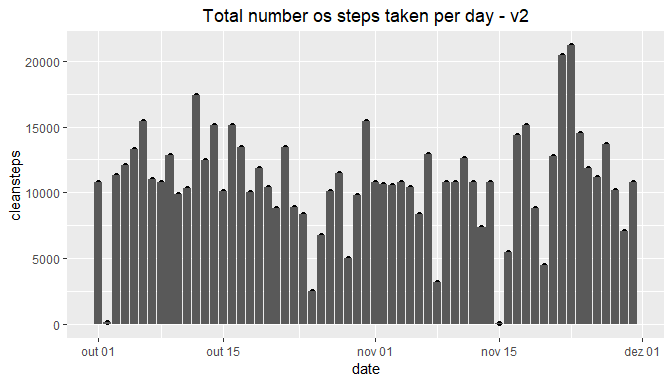
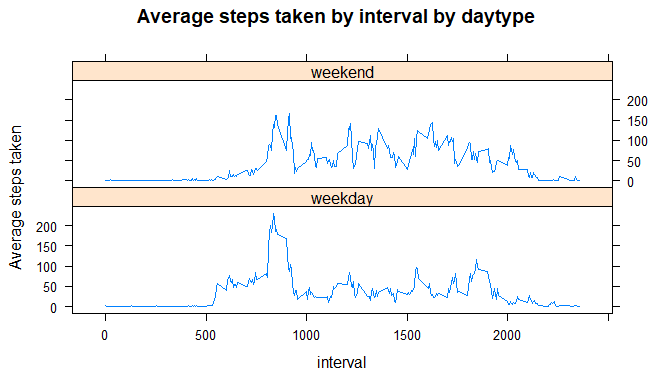

```r
knitr::opts_chunk$set(echo = TRUE, results = TRUE)
```

## Loading and preprocessing the data

### Loading data frame and adding packages

```r
unzip("activity.zip")
activity_data <- read.csv("activity.csv", stringsAsFactors =FALSE)
library(dplyr)
```

```
## 
## Attaching package: 'dplyr'
```

```
## The following objects are masked from 'package:stats':
## 
##     filter, lag
```

```
## The following objects are masked from 'package:base':
## 
##     intersect, setdiff, setequal, union
```

```r
library(lubridate)
```

```
## 
## Attaching package: 'lubridate'
```

```
## The following object is masked from 'package:base':
## 
##     date
```

```r
library(ggplot2)
library(lattice)
```

### Exploring data

```r
head(activity_data)
```

```
##   steps       date interval
## 1    NA 2012-10-01        0
## 2    NA 2012-10-01        5
## 3    NA 2012-10-01       10
## 4    NA 2012-10-01       15
## 5    NA 2012-10-01       20
## 6    NA 2012-10-01       25
```

```r
summary(activity_data)
```

```
##      steps            date              interval     
##  Min.   :  0.00   Length:17568       Min.   :   0.0  
##  1st Qu.:  0.00   Class :character   1st Qu.: 588.8  
##  Median :  0.00   Mode  :character   Median :1177.5  
##  Mean   : 37.38                      Mean   :1177.5  
##  3rd Qu.: 12.00                      3rd Qu.:1766.2  
##  Max.   :806.00                      Max.   :2355.0  
##  NA's   :2304
```

```r
str(activity_data)
```

```
## 'data.frame':	17568 obs. of  3 variables:
##  $ steps   : int  NA NA NA NA NA NA NA NA NA NA ...
##  $ date    : chr  "2012-10-01" "2012-10-01" "2012-10-01" "2012-10-01" ...
##  $ interval: int  0 5 10 15 20 25 30 35 40 45 ...
```

```r
mean(is.na(activity_data))
```

```
## [1] 0.04371585
```

### Preprocessing data
*Defining date as Date*

```r
activity_data$date <- ymd(activity_data$date)
class(activity_data$date)
```

```
## [1] "Date"
```

```r
head(activity_data)
```

```
##   steps       date interval
## 1    NA 2012-10-01        0
## 2    NA 2012-10-01        5
## 3    NA 2012-10-01       10
## 4    NA 2012-10-01       15
## 5    NA 2012-10-01       20
## 6    NA 2012-10-01       25
```

*Removing NAs*

```r
data <- activity_data[complete.cases(activity_data),]
head(data)
```

```
##     steps       date interval
## 289     0 2012-10-02        0
## 290     0 2012-10-02        5
## 291     0 2012-10-02       10
## 292     0 2012-10-02       15
## 293     0 2012-10-02       20
## 294     0 2012-10-02       25
```

##What is mean total number of steps taken per day?
*Calculate the total number of steps taken per day*

```r
stepsday <- data %>% select(steps, date) %>% group_by(date) %>% summarise_all(funs(sum))
stepsday
```

```
## # A tibble: 53 x 2
##    date       steps
##    <date>     <int>
##  1 2012-10-02   126
##  2 2012-10-03 11352
##  3 2012-10-04 12116
##  4 2012-10-05 13294
##  5 2012-10-06 15420
##  6 2012-10-07 11015
##  7 2012-10-09 12811
##  8 2012-10-10  9900
##  9 2012-10-11 10304
## 10 2012-10-12 17382
## # ... with 43 more rows
```

*Make a histogram of the total number of steps taken each day*

```r
qplot(date, steps, data=stepsday)+geom_bar(stat="identity")+ggtitle("Total number os steps taken per day")+ theme(plot.title = element_text(hjust = 0.5))
```

<!-- -->

*Calculate and report the mean and median of the total number of steps taken per day*

```r
mean(stepsday$steps)
```

```
## [1] 10766.19
```

```r
median(stepsday$steps)
```

```
## [1] 10765
```

##What is the average daily activity pattern?
*Make a time series plot (i.e. \color{red}{\verb|type = "l"|}type="l") of the 5-minute interval (x-axis) and the average number of steps taken, averaged across all days (y-axis)*

```r
stepsdayinteval <- data %>% group_by(interval) %>% summarise_at(vars(date,steps), funs(mean(steps))) %>% select(interval, steps)
```

```r
 plot(stepsdayinteval$interval, stepsdayinteval$steps, type = "l")
```

<!-- -->

*Which 5-minute interval, on average across all the days in the dataset, contains the maximum number of steps?*

```r
order_stepsbyinterval <- stepsdayinteval[order(-stepsdayinteval$steps), ]
head(order_stepsbyinterval,1)
```

```
## # A tibble: 1 x 2
##   interval steps
##      <int> <dbl>
## 1      835  206.
```
**The interval that contains the maximum number of steps is 835.**

##Imputing missing values
*Calculate and report the total number of missing values in the dataset (i.e. the total number of rows with NAs)*

```r
sum(is.na(activity_data))
```

```
## [1] 2304
```

```r
mean(is.na(activity_data))
```

```
## [1] 0.04371585
```

*Devise a strategy for filling in all of the missing values in the dataset. The strategy does not need to be sophisticated. For example, you could use the mean/median for that day, or the mean for that 5-minute interval, etc.*

```r
newdataset <- activity_data
newdataset <- merge(newdataset, stepsdayinteval, by ="interval")
```

*Create a new dataset that is equal to the original dataset but with the missing data filled in*

```r
newdataset <- mutate(newdataset, cleansteps = ifelse(is.na(newdataset$steps.x), newdataset$steps.y, newdataset$steps.x))
sum(is.na(newdataset$cleansteps))
```

```
## [1] 0
```

*Make a histogram of the total number of steps taken each day and Calculate and report the mean and median total number of steps taken per day. Do these values differ from the estimates from the first part of the assignment? What is the impact of imputing missing data on the estimates of the total daily number of steps?*

```r
newstepsday <- newdataset %>% select(cleansteps, date) %>% group_by(date) %>% summarise_all(funs(sum))
```


```r
 qplot(date, cleansteps, data=newstepsday)+geom_bar(stat="identity")+ggtitle("Total number os steps taken per day - v2")+ theme(plot.title = element_text(hjust = 0.5))
```

<!-- -->


```r
mean(newstepsday$cleansteps)
```

```
## [1] 10766.19
```

```r
median(newstepsday$cleansteps)
```

```
## [1] 10766.19
```

**The impact is that the mean is exactly the same but the median is now equal to the mean.**

##Are there differences in activity patterns between weekdays and weekends?
*Create a new factor variable in the dataset with two levels - "weekday" and "weekend" indicating whether a given date is a weekday or weekend day.*

```r
newdataset <- mutate(newdataset, daytype = wday(date))
newdataset$daytype <- ifelse(newdataset$daytype %in% c(2:6), 'weekday', 'weekend') 
```

*Make a panel plot containing a time series plot (i.e.type="l") of the 5-minute interval (x-axis) and the average number of steps taken, averaged across all weekday days or weekend days (y-axis). See the README file in the GitHub repository to see an example of what this plot should look like using simulated data.*

```r
daytype_avgsteps <- newdataset %>% select (interval, daytype, cleansteps) %>% group_by(interval, daytype) %>% summarise_all(funs(mean(cleansteps)))
```

```r
xyplot(cleansteps ~ interval | daytype, data = daytype_avgsteps, type ="l", layout = c(1,2), ylab = "Average steps taken", main ="Average steps taken by interval by daytype")
```

<!-- -->
